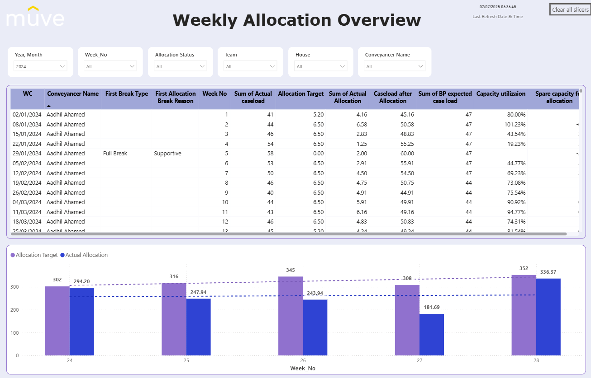

📊 Weekly Allocation Overview Dashboard
📌 Overview
This Power BI dashboard provides a detailed weekly view of conveyancer workload allocation. It helps team leads and operations managers monitor allocation targets, actual workloads, capacity utilization, and spare capacity. The dashboard enables data-driven planning by visualizing trends and exceptions across multiple weeks.

🎯 Key Features
Weekly breakdown of caseload vs. allocation per conveyancer

Capacity utilization and spare capacity metrics

Support for break types and allocation reasons (e.g., Full Break - Supportive)

Interactive slicers for Year/Month, Week Number, Allocation Status, Team, House, and Conveyancer

Bar chart comparison of allocation target vs. actual allocation

🛠️ Tools & Technologies
Power BI for visualization

DAX for custom measures and logic

SQL for data extraction and transformation

Slicers & Conditional Formatting for enhanced interactivity and usability

📈 Insights & Learnings
Through this project, I showcased my ability to:

Design operational dashboards that support workforce planning

Implement efficient DAX logic for complex calculations

Create user-friendly interfaces with intuitive filtering

Visualize performance data to highlight trends and inefficiencies

📸 Dashboard Preview

